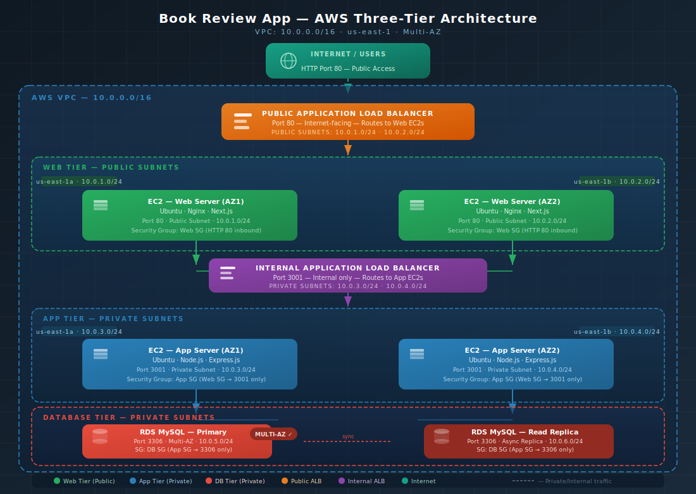

# 📚 Book Review App — AWS Capstone Deployment

> A production-ready, three-tier web application deployed on AWS following cloud and DevOps best practices.  
> Originally built as part of the [DevOps Zero to Hero: Docker, K8s, Cloud, CI/CD & 4 Projects](https://www.udemy.com/user/pravin-mishra-30/) Udemy course.

---

## 📖 Overview

**Book Review App** is a modern, full-stack **three-tier web application** that allows users to browse books, read reviews, and submit their own. It demonstrates clean separation of concerns between frontend and backend tiers, and serves as the foundation for a real-world AWS cloud deployment.

- **Unauthenticated users** can view book details and existing reviews.
- **Authenticated users** can register, log in, and submit reviews.

This capstone project takes the app further by deploying it on AWS in a secure, scalable, production-style architecture — mimicking what a real Cloud or DevOps Engineer would build on the job.

---

## 🏗️ AWS Architecture Overview

The app is deployed across three isolated tiers on AWS inside a custom VPC (`10.0.0.0/16`), spanning two Availability Zones for high availability.

| Tier | Technology | AWS Placement |
|------|-----------|----------------|
| **Web (Presentation)** | Next.js + Nginx on Ubuntu | EC2 in Public Subnets + Public ALB |
| **App (Business Logic)** | Node.js + Express (port 3001) | EC2 in Private Subnets + Internal ALB |
| **Database** | MySQL on Amazon RDS | Private Subnets, Multi-AZ + Read Replica |

### VPC & Subnet Design

| Subnet | Type | Availability Zone | CIDR |
|--------|------|-------------------|------|
| Web Subnet 1 | Public | us-east-1a | 10.0.1.0/24 |
| Web Subnet 2 | Public | us-east-1b | 10.0.2.0/24 |
| App Subnet 1 | Private | us-east-1a | 10.0.3.0/24 |
| App Subnet 2 | Private | us-east-1b | 10.0.4.0/24 |
| DB Subnet 1 | Private | us-east-1a | 10.0.5.0/24 |
| DB Subnet 2 | Private | us-east-1b | 10.0.6.0/24 |

### Security Group Rules

| Security Group | Inbound Port | Source |
|----------------|-------------|--------|
| Web SG | HTTP 80 | 0.0.0.0/0 (public internet) |
| App SG | TCP 3001 | Web SG only |
| DB SG | TCP 3306 | App SG only |

### Architecture Diagram


### Application-Level Architecture

- **Frontend**: Built using **Next.js**, providing server-side rendering and dynamic routing.
- **Backend**: Powered by **Node.js** and **Express.js**, handling authentication, book data, and reviews.
- **Database**: Uses **MySQL** with Sequelize ORM.

This three-tier architecture can be independently deployed, making it ideal for containerization, cloud hosting, and CI/CD implementation.

---

## 🌐 Public Entry Point

**Public ALB DNS:** *(To be updated after deployment)*

---

## ✨ Application Features

### 🔐 User Authentication
- User registration and login
- Email and password-based login
- Secure authentication using JWT tokens

### 📚 Book Management
- View all books
- Fetch detailed info for each book
- *(Future enhancement: Admins can add/edit books)*

### 📝 Review System
- View reviews for each book
- Authenticated users can post reviews
- Each review includes rating, username, and timestamp

### 🔄 State Management & API Integration
- Frontend dynamically interacts with backend APIs
- React Context manages global authentication state

---

## 🛠️ Technology Stack

### Frontend
- [Next.js](https://nextjs.org/) — React framework for SSR and routing
- Tailwind CSS — Utility-first CSS framework
- Axios — HTTP client for API calls
- React Context API — For managing global auth state

### Backend
- Node.js & Express.js — REST API development
- MySQL & Sequelize — Relational DB and ORM
- JWT — Token-based authentication
- bcrypt.js — Password hashing
- CORS — Cross-origin request handling

### AWS Infrastructure
- Amazon VPC — Custom network with public/private subnets
- Amazon EC2 — Ubuntu instances for web and app tiers
- Application Load Balancer (ALB) — Public (web) and Internal (app)
- Amazon RDS (MySQL) — Managed database with Multi-AZ and Read Replica
- Security Groups — Least-privilege access control per tier

---

## 📁 Repository Structure

```
book-review-app/
├── frontend/                  # Next.js frontend source code
│   ├── /src
│   │   ├── /app
│   │   │   ├── page.js        # Home page (list of books)
│   │   │   ├── /book/[id]     # Dynamic route for book details
│   │   │   ├── /login         # Login page
│   │   │   └── /register      # Register page
│   │   ├── /components        # Reusable UI components (Navbar, etc.)
│   │   ├── /context           # React Context for auth state
│   │   ├── /services          # Axios API functions
│   │   └── /styles            # Tailwind global styles
│   ├── next.config.js
│   └── package.json
│
├── backend/                   # Node.js/Express backend source code
│   ├── /src
│   │   ├── /config            # Database config and connection
│   │   ├── /models            # Sequelize models (User, Book, Review)
│   │   ├── /routes            # Express route handlers
│   │   ├── /controllers       # API business logic
│   │   ├── /middleware        # JWT auth middleware
│   │   └── server.js          # Entry point of the backend server
│   └── package.json
│
├── docs/                      # Step-by-step deployment documentation
│   ├── 01-vpc-setup.md        # VPC, subnets, route tables, IGW
│   ├── 02-security-groups.md  # Security group rules per tier
│   ├── 03-rds-setup.md        # MySQL RDS, Multi-AZ, Read Replica
│   ├── 04-app-tier.md         # Node.js backend EC2 deployment
│   ├── 05-web-tier.md         # Next.js + Nginx EC2 deployment
│   ├── 06-load-balancers.md   # Public ALB and Internal ALB setup
│   └── 07-testing.md          # End-to-end verification steps
│
├── architecture/              # Architecture diagram assets
├── screenshots/               # Deployment evidence screenshots
└── README.md                  # This file
```

---

## 🗂️ Application Structure

```
/book-review-app
 ├── /frontend   # Next.js frontend
 ├── /backend    # Node.js & Express backend
 └── README.md   # Project overview
```

### Frontend Directory Layout

```
/frontend
 ├── /src
 │   ├── /app
 │   │   ├── page.js          # Home page (list of books)
 │   │   ├── /book/[id]       # Dynamic route for book details
 │   │   ├── /login           # Login page
 │   │   ├── /register        # Register page
 │   ├── /components          # Reusable UI components (Navbar, etc.)
 │   ├── /context             # React Context for auth state
 │   ├── /services            # Axios API functions
 │   ├── /styles              # Tailwind global styles
 ├── next.config.js           # Next.js config
 ├── package.json             # Dependencies and scripts
 └── README.md                # Frontend-specific docs
```

### Backend Directory Layout

```
/backend
 ├── /src
 │   ├── /config              # Database config and connection
 │   ├── /models              # Sequelize models (User, Book, Review)
 │   ├── /routes              # Express route handlers
 │   ├── /controllers         # API business logic
 │   ├── /middleware          # JWT auth middleware
 │   └── server.js            # Entry point of the backend server
 ├── package.json             # Dependencies and scripts
 └── README.md                # Backend-specific docs
```

---

## ⚙️ Local Setup Instructions

Setup steps for both frontend and backend are provided in their respective folders:

- [`/frontend/README.md`](./frontend/README.md)
- [`/backend/README.md`](./backend/README.md)

Follow the instructions to install dependencies, configure environment variables, and start the application locally.

---

## 🚀 AWS Deployment Guide

Follow the documentation files in order for a complete deployment walkthrough:

1. [VPC & Subnet Setup](docs/01-vpc-setup.md)
2. [Security Groups](docs/02-security-groups.md)
3. [RDS MySQL Setup](docs/03-rds-setup.md)
4. [App Tier Deployment](docs/04-app-tier.md)
5. [Web Tier Deployment](docs/05-web-tier.md)
6. [Load Balancer Configuration](docs/06-load-balancers.md)
7. [Testing & Verification](docs/07-testing.md)

---

## 📸 Evidence & Screenshots

All deployment evidence screenshots are stored in the `/screenshots` folder, including:
- Web Tier EC2 instance
- App Tier EC2 instance
- Public ALB (healthy targets)
- Internal ALB (healthy targets)
- RDS instance + Read Replica
- Live App UI via ALB DNS

---

## 👤 Author

**Vivian Chiamaka Okose** — AWS Capstone Project  
Cloud & DevOps Engineering | Three-Tier Architecture on AWS

---

## 📌 About This Project

This project is built as a capstone for the **Udemy course: DevOps Zero to Hero: Docker, K8s, Cloud, CI/CD & 4 Projects**.

Through this deployment, practical experience is gained in:
- Designing secure, multi-tier AWS network architecture
- Deploying and configuring EC2 instances across public and private subnets
- Configuring Application Load Balancers for traffic routing
- Setting up managed RDS databases with high availability
- Debugging and troubleshooting cloud infrastructure end-to-end